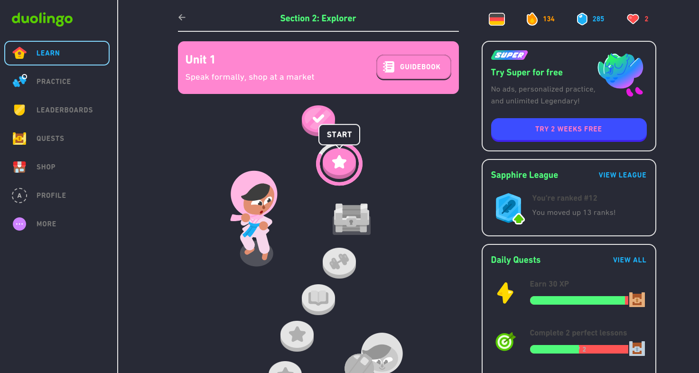

# Dracula for [Duolingo](https://duolingo.com)

> A dark theme for [Duolingo](https://Duolingo.com).

## Install

install with [stylus](chrome-extension://clngdbkpkpeebahjckkjfobafhncgmne/edit.html?id=4).

## Team

This theme is maintained by the following person(s) and a bunch of [awesome contributors](https://github.com/sonofactgnrd/Duolingo-Dark-Mode)

| 

| [Alden Clark](https://github.com/sonofactgnrd)

## Community

- [Twitter](https://twitter.com/draculatheme) - Best for getting updates about themes and new stuff.
- [GitHub](https://github.com/dracula/dracula-theme/discussions) - Best for asking questions and discussing issues.
- [Discord](https://draculatheme.com/discord-invite) - Best for hanging out with the community.

## License

[MIT License](./LICENSE)
